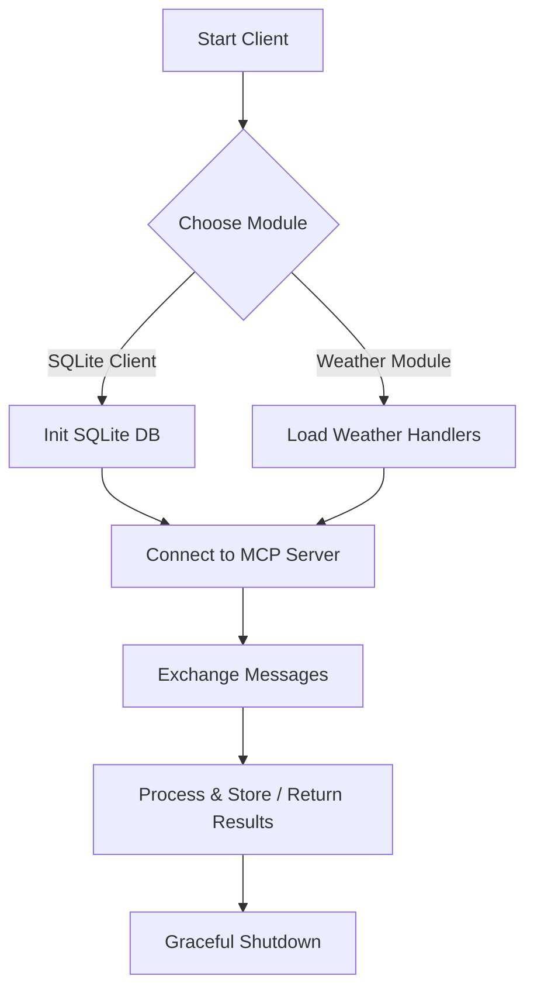

# ⚙️ MCP Projects — SQLite Client & Weather Module


> This repository contains two related MCP (Modular Client Protocol) example modules demonstrating protocol usage, persistence, and environment configuration:
> 1. **MCP SQLite Client** — a lightweight MCP client that uses SQLite for local storage.  
> 2. **MCP Weather** — a weather-module example implemented for MCP (sample data & client handlers).

---

## 📂 Repository Overview

```
MCP WORKING/
├── SQLlite/
│   └── mcp-client/            # Python MCP client using SQLite
│       ├── client.py
│       ├── pyproject.toml
│       ├── .env
│       ├── .gitignore
│       └── uv.lock
└── Weather/
    └── mcp-weather/           # MCP weather-related module & examples
        ├── weather_client.py
        ├── README.md
        └── sample_data/
```

> Note: folder names reflect the uploaded ZIP. Minor naming inconsistencies (e.g. `SQLlite`) were preserved to match the provided files.

---

## 🧩 High-level Description

### 1) **MCP SQLite Client** (`SQLlite/mcp-client`)
- A modular Python client demonstrating how to connect to an MCP server, exchange protocol messages, and persist relevant results into a local **SQLite** database.  
- Intended for local testing, prototyping, and as a learning reference for MCP integration patterns.

### 2) **MCP Weather Module** (`Weather/mcp-weather`)
- A sample MCP module focusing on weather-related requests — includes a small client/handler and sample datasets.  
- Useful as an example for building domain-specific MCP extensions (fetching and processing weather data, storing caches, etc.).

---

## 🧠 Architecture & Flow



---

## 🧱 Tech Stack

| Component | Technology |
|-----------|------------|
| Language | Python 3.11 |
| Persistence | SQLite (local DB) |
| Module examples | Weather handlers, sample data |
| Dependency manager | Poetry / pip (pyproject.toml present) |
| Env | `.env` for local config (do NOT push secrets) |

---

## ⚙️ Setup & Usage (Combined)

Run these steps from the repository root (`MCP WORKING/`). The examples assume you have Python 3.11 and either `pip` or `poetry` installed.

### 1. Remove any nested Git metadata (if you want to adopt this code into a fresh repo)
```bash
# from repo root
find . -type d -name ".git" -prune -exec rm -rf {} +
# on Windows PowerShell (run in repo root)
Get-ChildItem -Path . -Recurse -Force -Directory -Filter ".git" | ForEach-Object { Remove-Item -LiteralPath $_.FullName -Recurse -Force }
```

### 2. Install dependencies for MCP SQLite client
```bash
cd "SQLlite/mcp-client"
# If requirements.txt exists use pip; otherwise use poetry
pip install -r requirements.txt 2>/dev/null || true
poetry install 2>/dev/null || true
```

### 3. Configure environment (sample `.env`)
Create or update `SQLlite/mcp-client/.env` with minimal config (example):
```
MCP_SERVER_HOST=localhost
MCP_SERVER_PORT=8080
DATABASE_PATH=./data.db
```
> **Important:** Keep sensitive credentials out of version control. `.env` is present in the uploaded files — remove secrets before pushing to a public repo.

### 4. Run the SQLite client
```bash
python client.py
```

### 5. Run the Weather module example
```bash
cd ../../Weather/mcp-weather
python weather_client.py
```

> Each module typically logs connection attempts, message exchanges, and store/cache events. Check the console output for runtime details.

---

## 🧪 Example Commands & Tests

- Initialize a fresh git repo and push (example):
```bash
git init
git checkout -B main
git add .
git commit -m "Initial commit - MCP examples (SQLite client & Weather module)"
git remote add origin https://github.com/<your-username>/mcp-examples.git
git push -u origin main
```

- Run a quick smoke test (client-only):
```bash
python SQLlite/mcp-client/client.py --test
# or
python Weather/mcp-weather/weather_client.py --demo
```

(Adjust flags according to the scripts' internal parsers — open the files to confirm available options.)

---

## 🧰 Troubleshooting

- **Error: nested repo / submodule warnings** — remove nested `.git` folders (see step 1).  
- **Database lock or path issues** — check `DATABASE_PATH` in `.env` and ensure the process can create/write files.  
- **Dependencies not found** — inspect `pyproject.toml` or `requirements.txt` inside each module and install needed packages.  
- **Permission issues on Windows** — run PowerShell as Administrator or use appropriate user permissions for file operations.

---

## 🙏 Acknowledgements & Thanks

Special thanks to:
- **MCP (Modular Client Protocol)** documentation and community — the reference docs helped shape these examples.  
- **Claude** — for conceptual assistance and inspiration while learning integration patterns and refining examples.  

Your contributions and forks are welcome — please keep credits intact.

---

## 🧾 Suggested Repository Name & Description

**Repository name:** `mcp-examples`  
**Description:** `Python MCP example modules: SQLite client and Weather module — reference implementations for protocol learning and prototyping.`

---

## 👨‍💻 Author

**Avanish Sahai** — experimenting with modular protocols, local persistence, and domain modules.

---

## 📜 License

MIT License — see the LICENSE file for details.

---

⭐ **MCP Examples** — *Learn MCP. Build modules. Iterate fast.*
